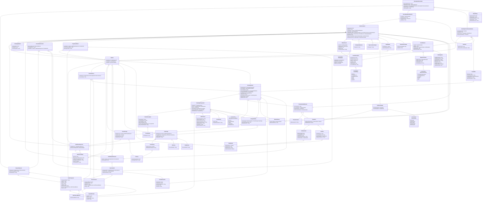

```mermaid
classDiagram
    %% Class definitions with attributes
    class BiocatalysisReactionSet {
        +ExpectedReactions?: string
        +WhatIsMeasured[0..*]: MeasuredSpecies
        +Reactions[0..*]: BiocatalysisBatchReaction | BiocatalysisContinuousReaction
        +ModelFitting[0..*]: ModelFitting
        +OtherAnalysis?: string
    }

    class ModelFitting {
        +EquationUsed?: string
        +FittingDetails?: string
        +ParameterFitted[0..*]: string
        +FittedValue[0..*]: float
        +FittedValueError[0..*]: float
    }

    class BiocatalysisBatchReaction {
        +Conditions?: BatchIncubation
        +SampleVolume?: float
        +ProgressData[0..*]: TimePoint
        +InitialRate?: float
    }

    class BiocatalysisContinuousReaction {
        +FeedComposition?: Solution
        +FeedRate?: float
        +ReactorType?: PackedBed | StirredReactor
        +PerformanceData[0..*]: TimePoint
    }

    class PackedBed {
        +Diameter?: float
        +ContactMaterials?: string
        +PackingMaterial?: BiocatalystUsed
        +PackingAmount?: float
        +OtherInformation?: string
    }

    class MeasuredSpecies {
        +TheSpecies?: SmallCompound | Macromolecule
        +MeasurementMethod?: string
        +MethodDetails?: string
    }

    class TimePoint {
        +ReactionTime?: float
        +MeasuredConcentrations[0..*]: float
    }

    class BatchIncubation {
        +Temperature?: float
        +Pressure?: float
        +TheMedium?: Solution | MultiPhaseDispersion
        +GasSupply?: GasSupplyDetails
        +FedBatchDetails[0..*]: pHmeasureAdjust | ConcentrationControl | ProgrammedFeed
        +MixingConditions?: ShakenVessel | StirredReactor | FlowImpelledReactor
        +BatchTime?: float
        +DispersionSampling?: RepresentativeSample | OnePhaseSample
        +SampleQuenching?: StopReagent | TemperatureChange
    }

    class MultiPhaseDispersion {
        +AddedItem[0..*]: AddedItemwithAmount
        +pHmeasuredAdjusted?: pHmeasureAdjust
    }

    class AddedItemwithAmount {
        +AnItem?: Solution | BiocatalystUsed | DescribeSolid
        +AmountAdded?: float
    }

    class Solution {
        +MainSolvent?: SmallCompound
        +ASolute[0..*]: SolutewithConc
        +pHdetails?: pHmeasureAdjust
    }

    class SmallCompound {
        +CompoundName?: string
        +IUPAC?: string
        +Smiles?: string
        +InChi?: string
        +ChEBI?: string
        +PubChemCID?: string
        +Source?: SuppliedProduct | SelfProducedMaterial
        +Purity?: string
    }

    class SolutewithConc {
        +TheMaterial?: SmallCompound | BiocatalystUsed | Macromolecule
        +Concentration?: float
    }

    class pHmeasureAdjust {
        +pHvalue?: float
        +MeasurementTemperature?: float
        +CalibrationTemperature?: float
        +NonaqueousCalibration?: string
        +Titrant?: Solution
        +ControlSystem?: string
    }

    class Macromolecule {
        +CompoundName?: string
        +DatabaseUsed?: string
        +Identifier?: string
        +Source?: SuppliedProduct | SelfProducedMaterial
        +Purity?: string
    }

    class SelfProducedMaterial {
        +ProductionMethod?: string
    }

    class DescribeSolid {
        +Component[0..*]: SmallCompound | Macromolecule
        +ParticleProps?: ParticleProperties
        +SurfaceChemistry?: string
    }

    class ParticleProperties {
        +ParticleSize?: string
        +SurfaceArea?: float
        +SurfaceAreaMethod?: string
        +Porosity?: float
        +PoreSize?: string
    }

    class GasSupplyDetails {
        +Composition?: string
        +FlowRate?: float
        +ContactSystem?: string
    }

    class ConcentrationControl {
        +MonitoredSpecies?: MeasuredSpecies
        +FeedAlgorithm?: string
        +FeedMade?: Solution | MultiPhaseDispersion | DescribeSolid
    }

    class ProgrammedFeed {
        +FeedMade?: Solution | MultiPhaseDispersion | DescribeSolid
        +ContinuousFeedRate?: float
        +DosingSchedule?: string
    }

    class ShakenVessel {
        +Vessel?: VesselDescription
        +ShakingType?: ShakingType
        +Deflection?: float
        +Speed?: float
        +VesselOrientation?: string
    }

    class VesselDescription {
        +HeightInternal?: float
        +DiameterInternal?: float
        +Shape?: VesselShape
        +Sealing?: string
        +Capacity?: float
        +VolumeFilled?: float
        +ContactMaterial?: string
    }

    class StirredReactor {
        +Vessel?: VesselDescription
        +Baffles?: string
        +ImpellerType?: MagneticFollower | ShaftImpellers
        +RotationRate?: float
        +PowerPerVolume?: float
    }

    class MagneticFollower {
        +StirBarShape?: MagneticBarShape
        +StirBarLength?: float
        +StirBarWidth?: float
        +ContactMaterial?: string
    }

    class ShaftImpellers {
        +ImpellerDiameter?: float
        +ImpellerGeometry?: string
        +NumberBlades?: integer
        +BladeDimensions?: string
        +BladePitch?: float
        +ImpellerHeight?: float
        +NumberImpellers?: integer
        +ImpellerSpacing?: float
    }

    class FlowImpelledReactor {
        +Properties?: string
    }

    class RepresentativeSample {
        +Procedure?: string
    }

    class OnePhaseSample {
        +PhaseSeparation?: Separation
        +PhaseSampled?: PhaseIdentity
    }

    class StopReagent {
        +TheReagent?: Solution
        +StoptoSampleRatio?: float
    }

    class TemperatureChange {
        +TemperatureApplied?: float
        +HoldTime?: float
    }

    class ProteinDescription {
        +ProteinName?: string
        +ProteinSequence?: string
        +UniProtKBlink?: string
        +MolecularWeight?: float
        +PostTranslationalModification?: DescribePTM
        +EnzymeClassification?: string
    }

    class BiocatalystUsed {
        +Preparations[0..*]: BiocatalystPreparation
        +AmountBasis?: BiocatalystAmountBasis
        +AmountDetails?: string
        +FormulationModification?: FormulationModification
        +StorageandStability?: StorageStability
        +StandardAssay?: StandardAssay
        +IsSoluble?: boolean
        +BiocatalystParticleProperties?: ParticleProperties
        +WettingLiquid?: Solution
        +LiquidContent?: float
    }

    class BiocatalystPreparation {
        +Protein[0..*]: ProteinDescription
        +Source?: SuppliedProduct | SelfProduced
        +Purity?: ProteinPurity
        +AmountBasis?: BiocatalystAmountBasis
        +StorageandStability?: StorageStability
        +StandardAssay?: StandardAssay
    }

    class StandardAssay {
        +AssayConditions?: BatchIncubation
        +MeasuredActivity?: string
    }

    class SuppliedProduct {
        +Supplier?: string
        +Name?: string
        +ProductCode?: string
        +LotNo?: string
    }

    class SelfProduced {
        +ExpressionSystem?: string
        +SequenceDNA?: string
        +SequencePlasmid?: string
        +SequenceSpecification?: string
        +OriginOrganism?: string
        +Purification?: string
        +SpecialTreatment?: string
    }

    class ProteinPurity {
        +Purity?: float
        +PurityDetermination?: string
    }

    class FormulationModification {
        +SummaryAim?: string
        +AnIncubation[0..*]: BatchIncubation
        +ASeparation[0..*]: Separation
        +ACharacterisation[0..*]: Characterisation
    }

    class Separation {
        +SolidLiquidSeparation?: Sedimentation | Filtration
        +SolidRetained?: boolean
    }

    class Sedimentation {
        +MediumHeight?: float
        +GravityApplied?: float
        +SettlingTime?: float
        +SupernatantCollection?: string
        +WashDetails[0..*]: WashDetails
    }

    class Filtration {
        +FilterMedium?: string
        +PressureDifference?: float
        +WashDetails[0..*]: WashDetails
        +ResidueCollection?: string
    }

    class WashDetails {
        +WashSolution?: Solution
        +WashVolume?: float
        +WashProtocol?: string
        +WashCombined?: boolean
    }

    class Characterisation {
        +AMeasurement?: string
    }

    class DescribePTM {
        +PTMDetails?: string
    }

    class StorageStability {
        +StorageType?: BatchIncubation | FrozenStorage | DryStorage
        +MaximalStorageTime?: float
        +StatementLoss?: string
    }

    class Freezing {
        +FreezeTemperature?: float
        +FreezingProcess?: string
    }

    class FrozenStorage {
        +WhatisFrozen?: Solution | MultiPhaseDispersion
        +InitialFreezing?: Freezing
        +HoldTemperature?: float
        +ThawProcess?: string
    }

    class DryStorage {
        +WhatisDried?: Solution | MultiPhaseDispersion
        +DryingMethod?: FreezeDrying | AirDrying | SprayDrying
        +HoldTemperature?: float
        +Rehydration?: string
    }

    class FreezeDrying {
        +InitialFreezing?: Freezing
        +SublimationConditions?: string
    }

    class AirDrying {
        +ProcessDetails?: string
    }

    class SprayDrying {
        +ProcessDetails?: string
    }

    %% Enum definitions
    class ShakingType {
        <<enumeration>>
        HORIZONTAL_RECIPROCAL
        HORIZONTAL_ROTARY
        VERTICAL_RECIPROCAL
        VERTICAL_ROTARY
    }

    class VesselShape {
        <<enumeration>>
        CONICAL
        CYLINDERFLAT
        CYLINDERROUND
        OTHER
        ROUND
        SQUARE
    }

    class MagneticBarShape {
        <<enumeration>>
        CYLINDERHORIZONTAL
        CYLINDERVERTICAL
        OCTAGON
        OTHER
        OVAL
    }

    class PhaseIdentity {
        <<enumeration>>
        GASPHASE
        LOWERLIQUID
        PRECIPITATE
        SUPERNATANT
        UPPERLIQUID
    }

    class BiocatalystAmountBasis {
        <<enumeration>>
        ACTIVITY
        MOLESENZYME
        OTHER
        TOTALMASS
        TOTALPROTEIN
    }

    %% Relationships
    BiocatalysisReactionSet "1" <|-- "*" MeasuredSpecies
    BiocatalysisReactionSet "1" <|-- "*" BiocatalysisBatchReaction
    BiocatalysisReactionSet "1" <|-- "*" BiocatalysisContinuousReaction
    BiocatalysisReactionSet "1" <|-- "*" ModelFitting
    BiocatalysisBatchReaction "1" <|-- "1" BatchIncubation
    BiocatalysisBatchReaction "1" <|-- "*" TimePoint
    BiocatalysisContinuousReaction "1" <|-- "1" Solution
    BiocatalysisContinuousReaction "1" <|-- "1" PackedBed
    BiocatalysisContinuousReaction "1" <|-- "1" StirredReactor
    BiocatalysisContinuousReaction "1" <|-- "*" TimePoint
    PackedBed "1" <|-- "1" BiocatalystUsed
    MeasuredSpecies "1" <|-- "1" SmallCompound
    MeasuredSpecies "1" <|-- "1" Macromolecule
    BatchIncubation "1" <|-- "1" Solution
    BatchIncubation "1" <|-- "1" MultiPhaseDispersion
    BatchIncubation "1" <|-- "1" GasSupplyDetails
    BatchIncubation "1" <|-- "*" pHmeasureAdjust
    BatchIncubation "1" <|-- "*" ConcentrationControl
    BatchIncubation "1" <|-- "*" ProgrammedFeed
    BatchIncubation "1" <|-- "1" ShakenVessel
    BatchIncubation "1" <|-- "1" StirredReactor
    BatchIncubation "1" <|-- "1" FlowImpelledReactor
    BatchIncubation "1" <|-- "1" RepresentativeSample
    BatchIncubation "1" <|-- "1" OnePhaseSample
    BatchIncubation "1" <|-- "1" StopReagent
    BatchIncubation "1" <|-- "1" TemperatureChange
    MultiPhaseDispersion "1" <|-- "*" AddedItemwithAmount
    MultiPhaseDispersion "1" <|-- "1" pHmeasureAdjust
    AddedItemwithAmount "1" <|-- "1" Solution
    AddedItemwithAmount "1" <|-- "1" BiocatalystUsed
    AddedItemwithAmount "1" <|-- "1" DescribeSolid
    Solution "1" <|-- "1" SmallCompound
    Solution "1" <|-- "*" SolutewithConc
    Solution "1" <|-- "1" pHmeasureAdjust
    SmallCompound "1" <|-- "1" SuppliedProduct
    SmallCompound "1" <|-- "1" SelfProducedMaterial
    SolutewithConc "1" <|-- "1" SmallCompound
    SolutewithConc "1" <|-- "1" BiocatalystUsed
    SolutewithConc "1" <|-- "1" Macromolecule
    pHmeasureAdjust "1" <|-- "1" Solution
    Macromolecule "1" <|-- "1" SuppliedProduct
    Macromolecule "1" <|-- "1" SelfProducedMaterial
    DescribeSolid "1" <|-- "*" SmallCompound
    DescribeSolid "1" <|-- "*" Macromolecule
    DescribeSolid "1" <|-- "1" ParticleProperties
    ConcentrationControl "1" <|-- "1" MeasuredSpecies
    ConcentrationControl "1" <|-- "1" Solution
    ConcentrationControl "1" <|-- "1" MultiPhaseDispersion
    ConcentrationControl "1" <|-- "1" DescribeSolid
    ProgrammedFeed "1" <|-- "1" Solution
    ProgrammedFeed "1" <|-- "1" MultiPhaseDispersion
    ProgrammedFeed "1" <|-- "1" DescribeSolid
    ShakenVessel "1" <|-- "1" VesselDescription
    ShakenVessel "1" <|-- "1" ShakingType
    VesselDescription "1" <|-- "1" VesselShape
    StirredReactor "1" <|-- "1" VesselDescription
    StirredReactor "1" <|-- "1" MagneticFollower
    StirredReactor "1" <|-- "1" ShaftImpellers
    MagneticFollower "1" <|-- "1" MagneticBarShape
    OnePhaseSample "1" <|-- "1" Separation
    OnePhaseSample "1" <|-- "1" PhaseIdentity
    StopReagent "1" <|-- "1" Solution
    ProteinDescription "1" <|-- "1" DescribePTM
    BiocatalystUsed "1" <|-- "*" BiocatalystPreparation
    BiocatalystUsed "1" <|-- "1" BiocatalystAmountBasis
    BiocatalystUsed "1" <|-- "1" FormulationModification
    BiocatalystUsed "1" <|-- "1" StorageStability
    BiocatalystUsed "1" <|-- "1" StandardAssay
    BiocatalystUsed "1" <|-- "1" ParticleProperties
    BiocatalystUsed "1" <|-- "1" Solution
    BiocatalystPreparation "1" <|-- "*" ProteinDescription
    BiocatalystPreparation "1" <|-- "1" SuppliedProduct
    BiocatalystPreparation "1" <|-- "1" SelfProduced
    BiocatalystPreparation "1" <|-- "1" ProteinPurity
    BiocatalystPreparation "1" <|-- "1" BiocatalystAmountBasis
    BiocatalystPreparation "1" <|-- "1" StorageStability
    BiocatalystPreparation "1" <|-- "1" StandardAssay
    StandardAssay "1" <|-- "1" BatchIncubation
    FormulationModification "1" <|-- "*" BatchIncubation
    FormulationModification "1" <|-- "*" Separation
    FormulationModification "1" <|-- "*" Characterisation
    Separation "1" <|-- "1" Sedimentation
    Separation "1" <|-- "1" Filtration
    Sedimentation "1" <|-- "*" WashDetails
    Filtration "1" <|-- "*" WashDetails
    WashDetails "1" <|-- "1" Solution
    StorageStability "1" <|-- "1" BatchIncubation
    StorageStability "1" <|-- "1" FrozenStorage
    StorageStability "1" <|-- "1" DryStorage
    FrozenStorage "1" <|-- "1" Solution
    FrozenStorage "1" <|-- "1" MultiPhaseDispersion
    FrozenStorage "1" <|-- "1" Freezing
    DryStorage "1" <|-- "1" Solution
    DryStorage "1" <|-- "1" MultiPhaseDispersion
    DryStorage "1" <|-- "1" FreezeDrying
    DryStorage "1" <|-- "1" AirDrying
    DryStorage "1" <|-- "1" SprayDrying
    FreezeDrying "1" <|-- "1" Freezing
```